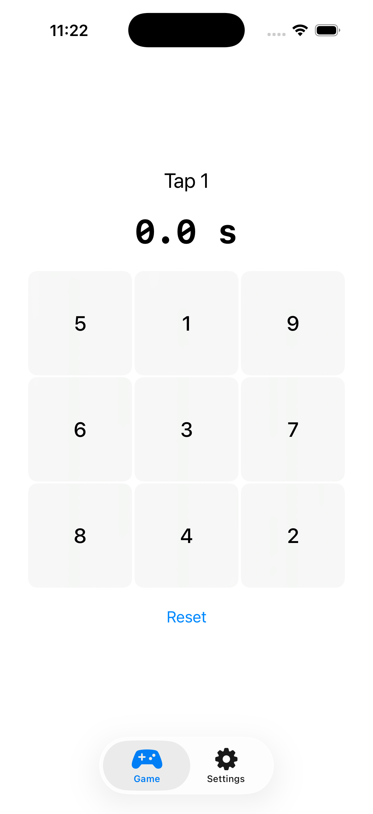
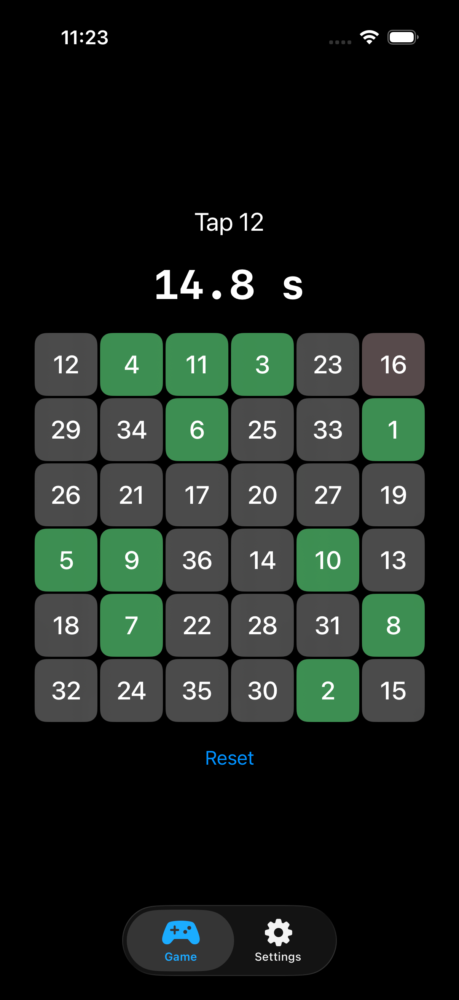

# SchulteGrid
A concentration training app built with SwiftUI, available for macOS and iPhone.

  
  

## Features
- **Multiple grid sizes** — choose from 3×3, 4×4, 5×5, or 6×6
- **Timer** — tracks how long you take to complete the grid
- **Visual feedback** — correct taps turn green, wrong taps flash red
- **Highlight toggle** — optionally hide the green highlight for a harder challenge
- **Dark mode** — toggle between light and dark theme
- **Blur UI** — frosted glass card design

## Tech Stack
 
- Swift
- SwiftUI
- Xcode

